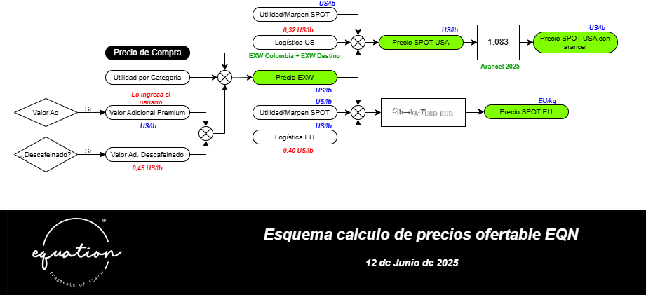

<h1> Automatización Offering List

    <em>Juan Pablo Vallejo Montañez</em> 
    <em>Data & Development Analyst</em> 
    <em>ia@equationcoffee.com</em>

## 1. Flujo completo del proceso

## 2. Esquema de Precios 

  
 

  <em>Figura 2 : Esquema calculo de precios ofertable EQN</em>
 

## 2. Modelos   

A continuación tienen 

## 3. Vistas

## 4. Grupos y Permisos

## 5. Desarrollos pendientes y anexos del desarollo 

## 6. Oportunidades de mejora

## 7.Resumen Proyectos

## 8. Resumen de Proyectos